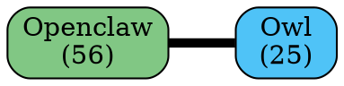
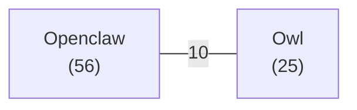

# Граф связей инсайтов — документация

## Обзор

Граф связей инсайтов — это визуализация связей между сущностями (агенты, проекты, технологии), извлечёнными из инсайтов лаборатории.

**Источник данных:** `/root/LabDoctorM/.qwen/artifacts/unique_insights.json`

**Форматы вывода:**
- DOT (Graphviz) — для рендеринга через `dot`, `fdp`, `neato`
- Mermaid — для встраивания в Markdown, Notion, GitHub

## Структура данных

Каждый инсайт в `unique_insights.json`:

```json
{
  "id": "INS-20260617171759-cb625463",
  "type": "decision | finding | pattern | error",
  "content": "Текст инсайта",
  "source": "owl | dominika | sessions | tool_output",
  "importance": 0.0-1.0,
  "context": "Тема/контекст инсайта",
  "tags": ["tag1", "tag2"],
  "confirmations": 0
}
```

**Типы инсайтов:**
- `decision` — принятое решение (наивысший приоритет для ADR)
- `finding` — находка/наблюдение
- `pattern` — обнаруженный паттерн
- `error` — ошибка/проблема

**Источники:**
- `owl`, `dominika` — экспертные инсайты (ручные)
- `sessions` — результат мининга сессий (автоматические)
- `tool_output` — вывод инструментов

## Формат графа

### DOT (Graphviz)



**Цвета узлов:**
- Синий (`#4FC3F7`) — агенты
- Зелёный (`#81C784`) — проекты
- Оранжевый (`#FFB74D`) — технологии/инструменты

**Связи:** неориентированные, вес = частота совместного упоминания.

### Mermaid



## Как обновить граф при новых инсайтах

### 1. Перегенерация из unique_insights.json

```bash
cd /root/LabDoctorM/workspaces/mangust
python3 build_graph.py
```

Выходные файлы:
- `outputs/insights-graph.dot` — полный граф (DOT)
- `outputs/insights-graph.mmd` — полный граф (Mermaid)
- `outputs/insights-graph-focused.mmd` — фокус-граф (только реальные темы)

### 2. Рендеринг DOT в PNG/SVG

```bash
# PNG
dot -Tpng outputs/insights-graph.dot -o outputs/insights-graph.png

# SVG (интерактивный)
dot -Tsvg outputs/insights-graph.dot -o outputs/insights-graph.svg

# Через fdp для больших графов
fdp -Tpng outputs/insights-graph.dot -o outputs/insights-graph-fdp.png
```

### 3. Рендеринг Mermaid

Mermaid рендерируется автоматически в:
- GitHub/GitLab Markdown
- Notion
- VS Code (с плагином Mermaid)
- [Mermaid Live Editor](https://mermaid.live)

### 4. Фильтрация шума

По умолчанию полный граф включает все инсайты, включая session-mining шум.

**Рекомендация:** используйте фокус-граф (`insights-graph-focused.mmd`), который исключает:
- Инсайты с тегом `session-mining`
- Инсайты с `importance < 0.8`
- Узлы с частотой < 3

## Критерии выбора ADR-кандидатов

Инсайты ранжируются по score для определения кандидатов в ADR:

```
score = importance × 10
      + type_bonus
      + source_bonus
      + context_bonus
      + confirmations × 2
```

**type_bonus:**
- `decision` — +8 (наивысший приоритет)
- `finding` — +6
- `pattern` — +4
- `error` — +2

**source_bonus:**
- `owl`, `dominika` — +3 (экспертные)
- `sessions` — +0 (автоматические)
- `tool_output` — +1

**context_bonus:**
- Не `session-mining` — +5
- `session-mining` — +0

**Порог для ADR:** score ≥ 20 (из максимальных ~25)

### Примеры высокоранговых инсайтов

| Score | Type     | Source   | Content                                      |
|-------|----------|----------|----------------------------------------------|
| 25.1  | decision | owl      | openclaw.json = единственный источник реестра |
| 23.4  | finding  | owl      | 47 уязвимостей в зависимостях                |
| 21.1  | pattern  | dominika | PostToolUse hooks не переносятся при миграции |
| 19.1  | pattern  | owl      | Таблицы ломают форматирование в Telegram     |

## Тесты

```bash
cd /root/LabDoctorM/workspaces/mangust
python3 -m pytest tests/test_insights_graph.py -v
```

Покрытие:
- Построение графа (DOT/Mermaid)
- Edge cases (пустой граф, один узел, циклы)
- Фильтрация по контексту
- Выбор ADR-кандидатов
- Валидация реальных данных

## Архитектура

```
unique_insights.json
        │
        ▼
   build_graph.py
        │
        ├──► insights-graph.dot      (полный DOT)
        ├──► insights-graph.mmd      (полный Mermaid)
        └──► insights-graph-focused.mmd  (фокус Mermaid)
                │
                ▼
           Mermaid Live Editor / GitHub / Notion
```

## Известные ограничения

- **Session-mining шум:** 225 из 235 инсайтов — из session-mining. Полный граф нечитаем.
- **Context API индекс:** свежие ADR-032..036 и PAT-012..013 не проиндексированы. Требуется переиндексация.
- **Статический граф:** граф строится из снапшота JSON. Для динамического обновления нужен таймер.

---
_Мангуст, 2026-06-18_
